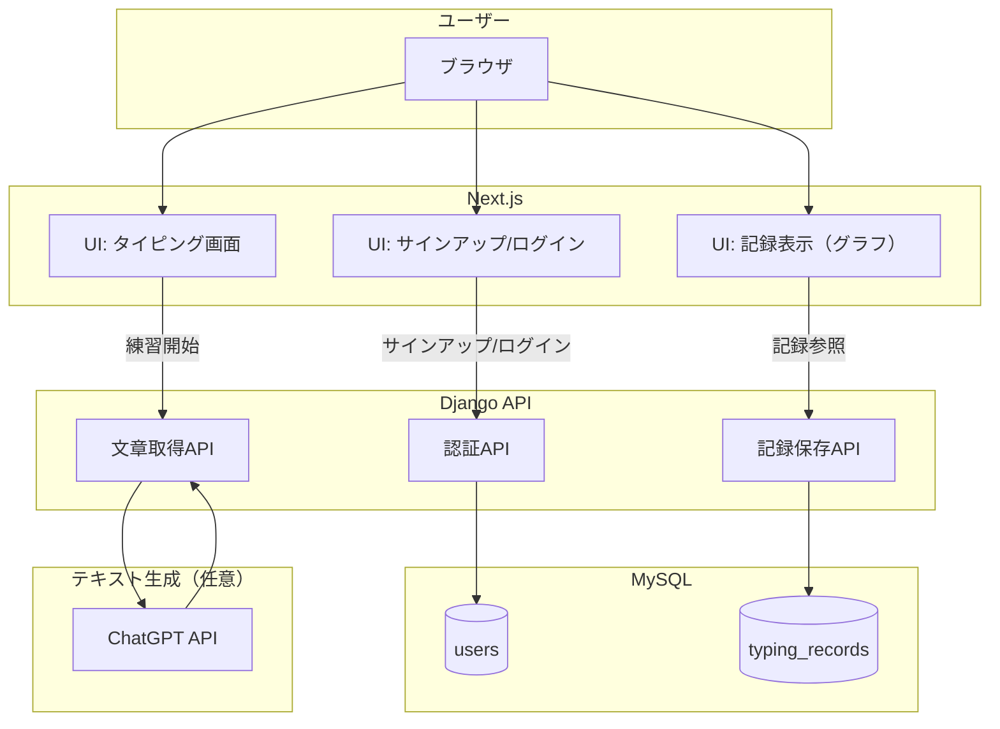

# タイピングアプリ（Next.js + Django）

セッション方式の認証でログイン/サインアップでき、タイピング結果（CPS・正答率）を保存・可視化できる学習用アプリです。フロントエンドは Next.js、バックエンドは Django、データベースは MySQL を使用します。Docker Compose で一括起動できます。

### 主な機能
- サインアップ / ログイン / ログアウト（Django セッション + CSRF）
- タイピング練習（カテゴリー指定可）
- タイピング結果の保存（CPS・正答率）
- マイページでの過去10回分の推移グラフ表示（ホバーで値、ツールチップ表示）
- アカウント削除（関連レコードのカスケード削除）
- 管理画面（/admin）

### 技術スタック
- フロントエンド: Next.js 15, React 19, Vitest, Testing Library, MSW
- バックエンド: Django 5, Django REST 的な構成, MySQL 8
- 認証: セッション + CSRF（ダブルサブミット）
- コンテナ: Docker Compose

---

## アーキテクチャ図



---

## セットアップ（Docker Compose）

1) 事前準備
- Docker / Docker Desktop（WSL2 推奨）
- Node.js はローカルテストに使いますが、Docker 起動のみで動作可

2) 環境変数ファイル（任意）
プロジェクト直下に `.env` を用意して、以下のように設定できます（例）。

```env
# Frontend
NEXT_PUBLIC_API_BASE=http://backend:8000
NODE_ENV=development

# Backend / DB
DB_HOST=db
DB_NAME=typing
DB_USER=app
DB_PASS=appsecret
DB_ROOT_PASSWORD=rootpass
DJANGO_SECRET_KEY=dev-key
DJANGO_ALLOWED_HOSTS=*
# OPENAI_API_KEY=sk-...  # 任意（/api/prompt を実利用する場合）
```

3) 起動/停止

PowerShell（WSL経由）:
```powershell
wsl docker compose up -d
# 停止
wsl docker compose down
```

起動後:
- フロントエンド: http://localhost:3000
- バックエンド: http://localhost:8000

---

## 使い方

- サインアップ: フロントの「サインアップ」ページから作成
- ログイン後: 「タイピング」ページで練習 → 結果がサーバへ保存（ログイン時）
- マイページ: 「me」ページで過去10回分の推移をグラフ表示（ホバーでツールチップ）
- アカウント削除: 「me」ページの削除ボタンから。ユーザーと記録が削除されます。
- 管理画面: http://localhost:8000/admin（必要に応じて `createsuperuser` 実行）

---

## API 一覧（抜粋）

認証（/api/auth）
- GET  `/api/auth/csrf`        CSRF トークン付与
- POST `/api/auth/signup`      サインアップ（201）
- POST `/api/auth/login`       ログイン（200）
- POST `/api/auth/logout`      ログアウト（200）
- GET  `/api/auth/me`          現在ユーザー情報（未ログインは 401）
- POST `/api/auth/delete`      アカウント削除（要ログイン）

コア（/api）
- GET  `/api/health`           ヘルスチェック
- GET  `/api/prompt?category=` 練習用テキスト取得（LLM 任意）
- POST `/api/result`           結果保存（body: { cps, accuracy }）

備考: 末尾スラッシュ無し/有りの両方に対応するよう一部ルートは設定されています。

---

## テスト

フロントエンド（Vitest）:
```powershell
cd frontend
npm run test
```

バックエンド（Django）:
```powershell
wsl docker compose exec backend python manage.py test
```

---

## 開発のポイント

- セッション + CSRF（ダブルサブミット）で Web 向けに安全なログイン体験を提供
- Next.js 側は `/api/...` をバックエンドに rewrite（`NEXT_PUBLIC_API_BASE`）
- テスト: バックエンドは Django TestCase、フロントは Vitest + Testing Library + MSW を採用
- グラフは SVG で自前描画し、ホバー時にガイドライン・ツールチップ表示

---

## ライセンス

このリポジトリのコードは、特に記載がない限り MIT ライセンスに準じます。